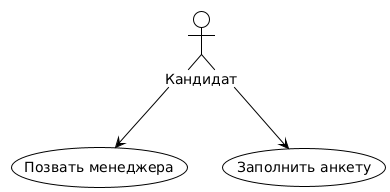
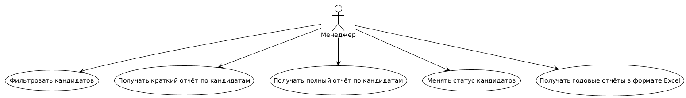
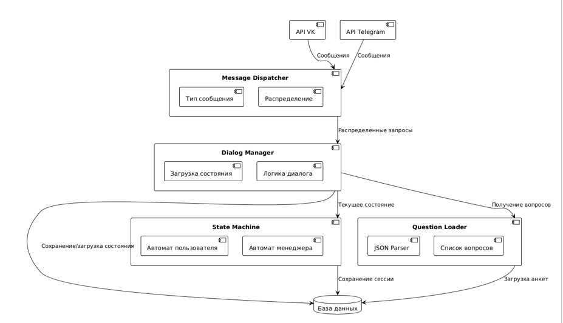

# HRBotSystem

Система HR-ботов для **ВКонтакте** и **Telegram**, разработанная с использованием паттерна **Стратегия**, объединяющая:
- гибкое анкетирование кандидатов,
- запись данных в асинхронную базу данных SQLite,
- менеджмент анкет кандидатов для HR-специалиста.

---
## Быстрый старт

1. Установите зависимости:

```bash
pip install -r requirements.txt
```

2. Создайте файл quest.json в корне проекта. Пример содержимого:
```json
[
  {
    "text": "📝  Укажите Ваш пол",
    "type": "choice",
    "variant": ["Мужчина", "Женщина"],
    "checktext": "Пол",
    "baseCollumb": "Sex"
  },
  {
    "text": "📝  Укажите дату Вашего рождения",
    "type": "date",
    "datacheck": "birth",
    "checktext": "Дата рождения",
    "baseCollumb": "DateOfBirth"
  },
  {
    "text": "📝  Укажите дату, когда вы готовы начать работать.",
    "type": "date",
    "datacheck": "work",
    "checktext": "Могу начать работать с",
    "baseCollumb": "DateofStart"
  }
```

3. Запустите бота:

```bash
python Bot.py
```
 

---
## Сценарии взаимодействия

Функции кандидата - заполнить анкету и позвать менеджера.  Работа бота будет прекращена с момента, когда менеджер ответит кандидату и до того как кандиат снова "позовёт" бота.
<p align="center">
  
</p>
Менеджер имеет большое количество возможности фильтрации кандидатов, а также взаимодействия с базой данных. Конечная его цель - получение нужного отчёта в формате Excel.
<p align="center">
  
</p>

---
## Архитектура

Система состоит из следующих компонентов:

- **Ядро бота**  
  Построено на `aiogram`, отвечает за маршрутизацию команд и взаимодействие с Telegram API.

- **Слой хранения данных**  
  `SQLite` с возможной асинхронной обвязкой (`aiosqlite`). Сохраняет анкеты, пользовательское состояние и статистику.

- **Механизм опроса**  
  Загружает структуру из `quest.json` и управляет логикой опроса (включая ветвления, варианты ответов, медиафайлы и прерывания).

- **Интерфейс администратора**  
  Реализован через Telegram: отображение списка анкет, возможность одобрения/удаления, статистика.

- **Модуль обработки вопросов (`Question`)**  
  Валидация структуры анкеты, логика переходов, сохранение ответов и отрисовка inline-кнопок.

 Диаграмма компонентов:  
<p align="center">
  
</p>

---
